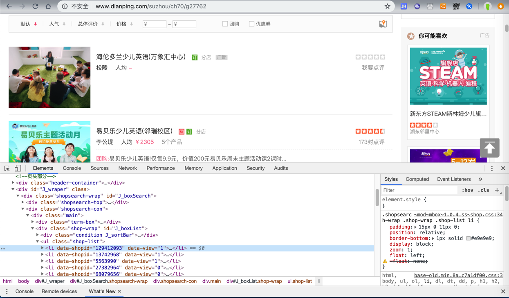
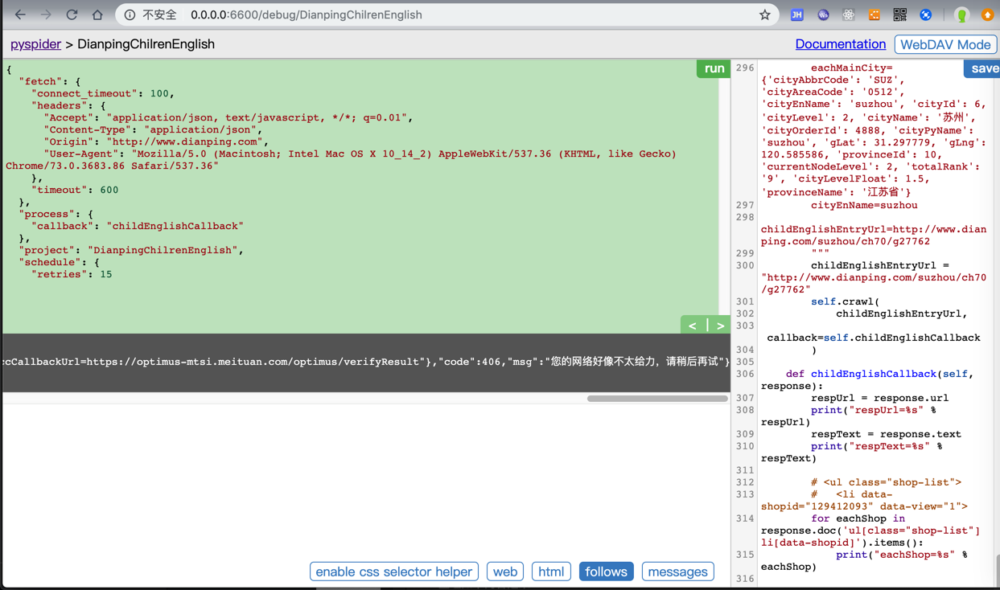
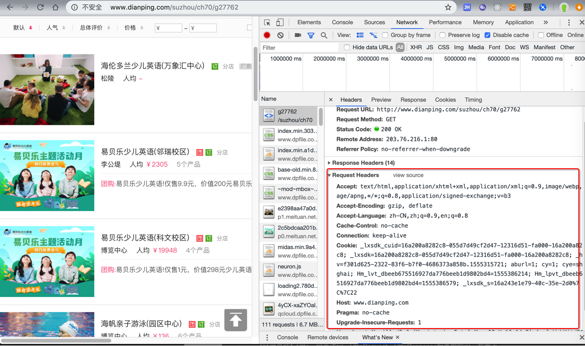
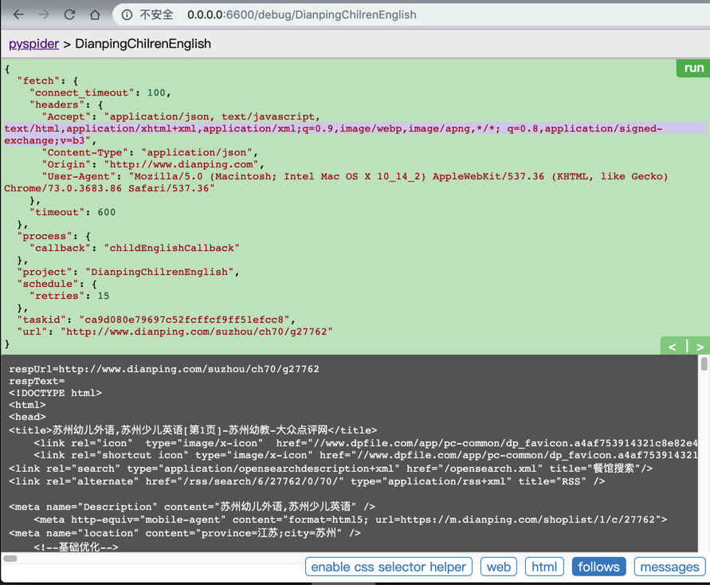

# 动态网页

* **动态网页**
  * 是相对于`静态网页`来说的
  * 指的是，通过爬虫抓取代码得到的源码，往往只是（用户通过浏览器看到的全部内容的）其中一部分
    * 剩下的内容，需要动态加载
      * 往往需要我们额外再发出请求获取对应内容
        * 前提是需要调试分析网页内容加载的逻辑

相关内容：

[【教程】手把手教你如何利用工具(IE9的F12)去分析模拟登陆网站(百度首页)的内部逻辑过程](http://www.crifan.com/use_ie9_f12_to_analysis_the_internal_logical_process_of_login_baidu_main_page_website)

[【记录】模拟登陆google](https://www.crifan.com/files/doc/docbook/web_scrape_emulate_login/release/html/web_scrape_emulate_login.html)

[【教程】如何抓取动态网页内容](http://www.crifan.com/how_to_crawl_dynamic_webpage_content)

[【教程】以抓取网易博客帖子中的最近读者信息为例，手把手教你如何抓取动态网页中的内容](http://www.crifan.com/example_to_crawl_dynamic_webpage_content_of_recent_reader_info_for_netease_blog_post)

TODO：

找个，需要登录的网站，或者是是网页内容需要后续执行js才能加载的例子，再去用抓包工具模拟登录，或分析数据是如何加载的。

## 举例：Chrome分析大众点评某页面获取店铺数据后用PySpider实现代码并下载数据

此次通过举例来说明，如何：

* 用Chrome分析逻辑后
* 再去（PySpider的）代码实现

期间要注意的是：要一点点模拟各种参数，才能获取到数据，否则会出现各种错误

要分析的网址：

http://www.dianping.com/suzhou/ch70/g27762

用Chrome打开后，是可以获取到数据的：



但是PySpider中，用代码：

```python
#!/usr/bin/env python
# -*- encoding: utf-8 -*-
# Created on 2019-04-15 14:56:12
# Project: DianpingChilrenEnglish

from pyspider.libs.base_handler import *

import os
import json
import codecs
import base64
import gzip
import copy
import time
import re
import csv
# import datetime
from datetime import datetime, timedelta

######################################################################
# Const
######################################################################
...
constCityListNamePattern = "cityList_%s_%s.json"
constMainCityFilename = "mainCityWithLevelList.json"

constUserAgentMacChrome = "Mozilla/5.0 (Macintosh; Intel Mac OS X 10_14_2) AppleWebKit/537.36 (KHTML, like Gecko) Chrome/73.0.3683.86 Safari/537.36"

gHost = "http://www.dianping.com"

CategoryLevel1ParentChild = "ch70" # 全部分类->亲子
CategoryLevel2ChildEnglish = "g27762" # 幼儿教育 -> 幼儿外语

######################################################################
# Project Specific Functions
######################################################################

######################################################################
# Main
######################################################################

class Handler(BaseHandler):
    crawl_config = {
        "connect_timeout": 100,
        "timeout": 600,
        "retries": 15,
        "headers": {
            "User-Agent": constUserAgentMacChrome,
            "Accept": "application/json, text/javascript, */*; q=0.01",
            "Content-Type": "application/json",
            "Origin": "http://www.dianping.com",
            # "X-Requested-With": "XMLHttpRequest",
        }
    }

    def on_start(self):
        # self.init()

        self.realStart()

    def realStart(self):
        ...
        # for debug
        """
        eachMainCity={'cityAbbrCode': 'SUZ', 'cityAreaCode': '0512', 'cityEnName': 'suzhou', 'cityId': 6, 'cityLevel': 2, 'cityName': '苏州', 'cityOrderId': 4888, 'cityPyName': 'suzhou', 'gLat': 31.297779, 'gLng': 120.585586, 'provinceId': 10, 'currentNodeLevel': 2, 'totalRank': '9', 'cityLevelFloat': 1.5, 'provinceName': '江苏省'}
        cityEnName=suzhou
        childEnglishEntryUrl=http://www.dianping.com/suzhou/ch70/g27762
        """
        childEnglishEntryUrl = "http://www.dianping.com/suzhou/ch70/g27762"
        self.crawl(
            childEnglishEntryUrl,
            callback=self.childEnglishCallback
        )

    def childEnglishCallback(self, response):
        respUrl = response.url
        print("respUrl=%s" % respUrl)
        respText = response.text
        print("respText=%s" % respText)

        # <ul class="shop-list">
        #   <li data-shopid="129412093" data-view="1">
        for eachShop in response.doc('ul[class="shop-list"] li[data-shopid]').items():
            print("eachShop=%s" % eachShop)
```

结果返回错误信息：

```bash
respText={"customData":{"requestCode":"c9847c945a1440d49460df748b757250","verifyUrl":"https://optimus-mtsi.meituan.com/optimus/verify?request_code=c9847c945a1440d49460df748b757250","imageUrl":"https://verify.meituan.com/v2/captcha?action=spiderindefence&request_code=c9847c945a1440d49460df748b757250","verifyPageUrl":"https://verify.meituan.com/v2/app/general_page?action=spiderindefence&requestCode=c9847c945a1440d49460df748b757250&platform=1000&adaptor=auto&succCallbackUrl=https://optimus-mtsi.meituan.com/optimus/verifyResult"},"code":406,"msg":"您的网络好像不太给力，请稍后再试"}
```



然后去参考Chromet中看到的参数：



对于各种header，想办法一个个加上去试试，最终发现是：

给`Accept`加上`text/html`相关类型：

```python
# "Accept": "application/json, text/javascript, */*; q=0.01",
"Accept": "application/json, text/javascript, text/html,application/xhtml+xml,application/xml;q=0.9,image/webp,image/apng,*/*; q=0.8,application/signed-exchange;v=b3",
```

就可以获取到数据了：



-》还是之前提到的哪个逻辑：想办法参考`Chrome`调试看到的所有的重要参数：

* `url`中的`query string`
* `header`中有价值的部分
* 甚至相关的`cookie`，`session`，`localStorage`等内容

都加上后，多数情况下，就可以获取到对应的返回的数据了。
