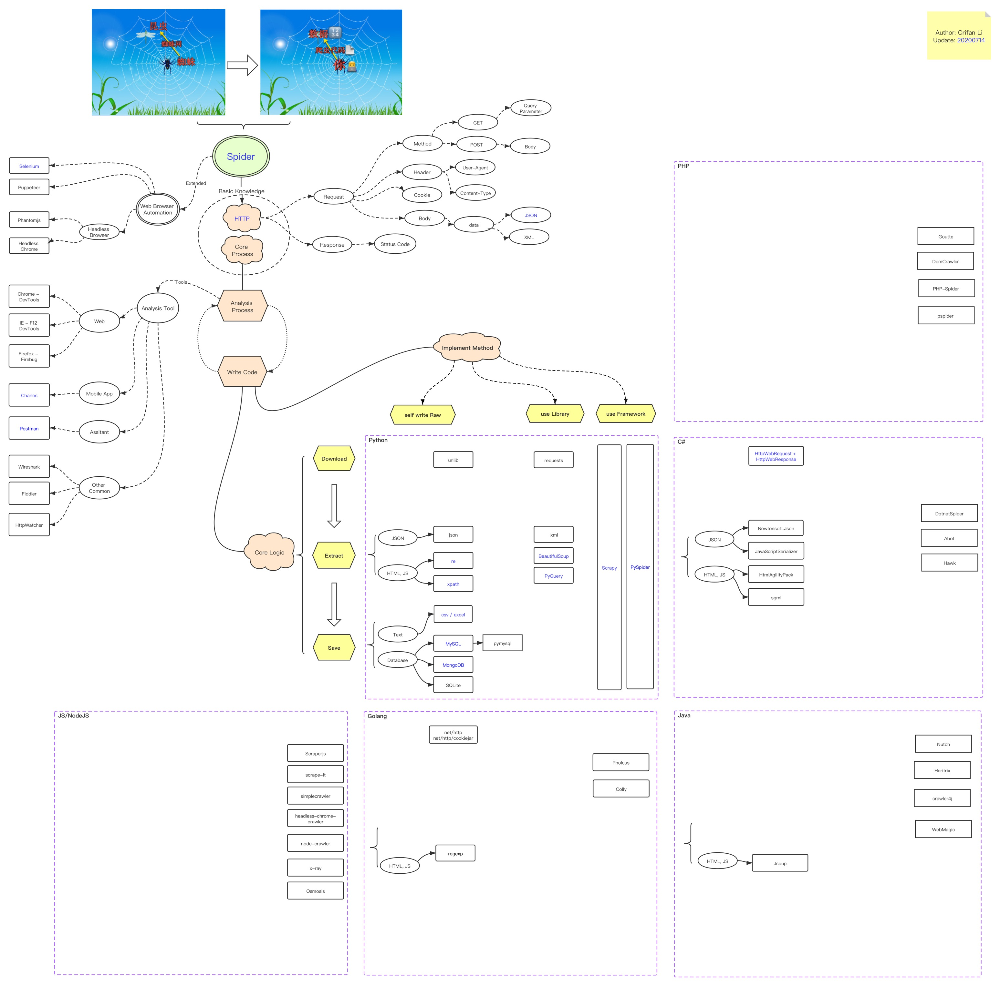

# 爬虫的核心逻辑

## 整体概览和技术路线图

爬虫的核心逻辑和整体结构和技术路线图，可以通过 一图胜千言 来表示：

* 在线浏览
  * [Spider Roadmap 20200714 - ProcessOn](https://www.processon.com/view/link/5d12dba7e4b09b096ead6880)
* 图
  * 

## 核心逻辑和原理

接下来的文字解释，是对上述核心逻辑的详细诠释：

爬虫的最核心的逻辑和原理，主要包含：

* 爬虫的核心`流程`
  * 先要`抓包分析`
  * 再去`写爬虫代码`
* 爬虫的核心`步骤`=核心`功能`：写爬虫之前，要搞懂爬虫主要做了哪些事情
  * `下载`
  * `提取`
  * `保存`
* 爬虫的典型`实现方式`：然后再去搞懂有哪些方式去实现你的爬虫
  * `裸写`代码
  * 用`库`写
  * 用`框架`写
    * 再去搞懂：
      * 为何要用框架
      * 以及有哪些语言的哪些`爬虫框架`
    * 然后才是选用合适的语言的合适的爬虫框架，去基于框架写爬虫代码

下面详细解释。