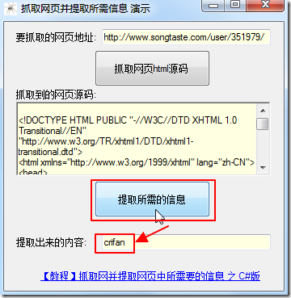

# 用C#写爬虫

C#中和爬虫相关的内置库有：

* 网络相关
  * `System.Net`
  * `System.IO`
* 内容提取解析
  * 正则
    * `System.Text.RegularExpressions`

## C#爬虫举例

之前整理过一些C#的爬虫方面的例子。整理于此供参考。

其中后续章节会专门介绍：

* [C#模拟登录百度首页](http://book.crifan.com/books/crawl_your_data_spider_technology/website/how_write_spider/use_csharp/cs_emulate_login_baidu.html)

### C#提取songtaste中h1user的值crifan

完整代码：

```cs
using System;
using System.Collections.Generic;
using System.ComponentModel;
using System.Data;
using System.Drawing;
using System.Text;
using System.Windows.Forms;
 
using System.Net;
using System.IO;
using System.Text.RegularExpressions;
 
namespace crawlWebsiteAndExtractInfo
{
    public partial class frmCrawlWebsite : Form
    {
        public frmCrawlWebsite()
        {
            InitializeComponent();
        }
 
        private void btnCrawlAndExtract_Click(object sender, EventArgs e)
        {
            //step1: get html from url
            //http://www.songtaste.com/user/351979/
            string urlToCrawl = txbUrlToCrawl.Text;
            //generate http request
            HttpWebRequest req = (HttpWebRequest)WebRequest.Create(urlToCrawl);
            //use GET method to get url's html
            req.Method = "GET";
            //use request to get response
            HttpWebResponse resp = (HttpWebResponse)req.GetResponse();
            string htmlCharset = "GBK";
            //use songtaste's html's charset GB2312 to decode html
            //otherwise will return messy code
            Encoding htmlEncoding = Encoding.GetEncoding(htmlCharset);
            StreamReader sr = new StreamReader(resp.GetResponseStream(), htmlEncoding);
            //read out the returned html
            string respHtml = sr.ReadToEnd();
            rtbExtractedHtml.Text = respHtml;
        }
 
        private void btnExtractInfo_Click(object sender, EventArgs e)
        {
            //step2: extract expected info
            //<h1 class="h1user">crifan</h1>
            string h1userP = @"<h1\s+class=""h1user"">(?<h1user>.+?)</h1>";
            Match foundH1user = (new Regex(h1userP)).Match(rtbExtractedHtml.Text);
            if (foundH1user.Success)
            {
                //extracted the expected h1user's value
                txbExtractedInfo.Text = foundH1user.Groups["h1user"].Value;
            }
            else
            {
                txbExtractedInfo.Text = "Not found h1 user !";
            }
        }
 
        private void lklTutorialUrl_LinkClicked(object sender, LinkLabelLinkClickedEventArgs e)
        {
            string tutorialUrl = "https://www.crifan.com/crawl_website_html_and_extract_info_using_csharp";
            System.Diagnostics.Process.Start(tutorialUrl);
        }
    }
}
```

运行效果截图：



完整代码（VS2010的项目）下载：

[crawlWebsiteAndExtractInfo_csharp_2012-11-07.7z](http://book.crifan.com/books/crawl_your_data_spider_technology/website/assets/file/crawlWebsiteAndExtractInfo_csharp_2012-11-07.7z)

具体细节详见：

* [【教程】抓取网并提取网页中所需要的信息 之 C#版](http://www.crifan.com/crawl_website_html_and_extract_info_using_csharp)

## C#爬虫相关通用函数代码段

在折腾C#爬虫期间，把网络功能等常用函数和代码段，整理成独立函数：

[crifanLib.cs](https://github.com/crifan/crifanLib/blob/master/csharp/crifanLib.cs)

且额外加了文档说明：

[crifanLib.cs之Http - 详解crifan的C#库：crifanLib.cs](https://www.crifan.com/files/doc/docbook/crifanlib_csharp/release/html/crifanlib_csharp.html#http)