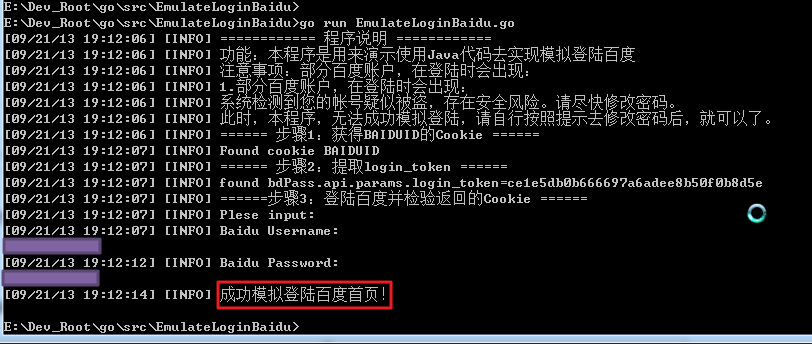

# Go模拟登录百度首页

很久之前用`Go`实现了模拟登录百度

完整代码为：

```go
/*
 * [File]
 * EmulateLoginBaidu.go
 *
 * [Function]
 * 【记录】用go语言实现模拟登陆百度
 * https://www.crifan.com/emulate_login_baidu_using_go_language/
 *
 * [Version]
 * 2013-09-21
 *
 * [Contact]
 * https://www.crifan.com/about/me/
 */
package main
 
import (
    "fmt"
    //"builtin"
    //"log"
    "os"
    "runtime"
    "path"
    "strings"
    "time"
    //"io"
    "io/ioutil"
    "net/http"
    "net/http/cookiejar"
    "net/url"
    //"sync"
    //"net/url"
    "regexp"
    //"bufio"
    "bytes"
)
 
//import l4g "log4go.googlecode.com/hg"
//import l4g "code.google.com/p/log4go"
import "code.google.com/p/log4go"
 
/***************************************************************************************************
    Global Variables
***************************************************************************************************/
var gCurCookies []*http.Cookie;
var gCurCookieJar *cookiejar.Jar;
var gLogger log4go.Logger;
 
/***************************************************************************************************
    Functions
***************************************************************************************************/
//do init before all others
func initAll(){
    gCurCookies = nil
    //var err error;
    gCurCookieJar,_ = cookiejar.New(nil)
    gLogger = nil
     
    initLogger()
    initCrifanLib()
}
 
//de-init for all
func deinitAll(){
    gCurCookies = nil
    if(nil == gLogger) {
        gLogger.Close();
        //os.Stdout.Sync() //try manually flush, but can not fix log4go's flush bug
         
        gLogger = nil
    }
}
 
//do some init for crifanLib
func initCrifanLib(){
    gLogger.Debug("init for crifanLib")
    gCurCookies = nil
    return
}
 
//init for logger
func initLogger(){
    var filenameOnly string = GetCurFilename()
    var logFilename string =  filenameOnly + ".log";
     
    //gLogger = log4go.NewLogger()
    //gLogger = make(log4go.Logger)
     
    //for console
    //gLogger.AddFilter("stdout", log4go.INFO, log4go.NewConsoleLogWriter())
    gLogger = log4go.NewDefaultLogger(log4go.INFO)
     
    //for log file
    if _, err := os.Stat(logFilename); err == nil {
        //fmt.Printf("found old log file %s, now remove it\n", logFilename)
        os.Remove(logFilename)
    }
    //gLogger.AddFilter("logfile", log4go.FINEST, log4go.NewFileLogWriter(logFilename, true))
    //gLogger.AddFilter("logfile", log4go.FINEST, log4go.NewFileLogWriter(logFilename, false))
    gLogger.AddFilter("log", log4go.FINEST, log4go.NewFileLogWriter(logFilename, false))
    gLogger.Debug("Current time is : %s", time.Now().Format("15:04:05 MST 2006/01/02"))
     
    return
}
 
// GetCurFilename
// Get current file name, without suffix
func GetCurFilename() string {
    _, fulleFilename, _, _ := runtime.Caller(0)
    //fmt.Println(fulleFilename)
    var filenameWithSuffix string
    filenameWithSuffix = path.Base(fulleFilename)
    //fmt.Println("filenameWithSuffix=", filenameWithSuffix)
    var fileSuffix string
    fileSuffix = path.Ext(filenameWithSuffix)
    //fmt.Println("fileSuffix=", fileSuffix)
     
    var filenameOnly string
    filenameOnly = strings.TrimSuffix(filenameWithSuffix, fileSuffix)
    //fmt.Println("filenameOnly=", filenameOnly)
     
    return filenameOnly
}
 
//get url response html
func getUrlRespHtml(strUrl string, postDict map[string]string) string{
    gLogger.Debug("in getUrlRespHtml, strUrl=%s", strUrl)
    gLogger.Debug("postDict=%s", postDict)
     
    var respHtml string = "";
     
    httpClient := &http.Client{
        //Transport:nil,
        //CheckRedirect: nil,
        Jar:gCurCookieJar,
    }
 
    var httpReq *http.Request
    //var newReqErr error
    if nil == postDict {
        gLogger.Debug("is GET")
        //httpReq, newReqErr = http.NewRequest("GET", strUrl, nil)
        httpReq, _ = http.NewRequest("GET", strUrl, nil)
        // ...
        //httpReq.Header.Add("If-None-Match", `W/"wyzzy"`)
    } else {
        //【记录】go语言中实现http的POST且传递对应的post data
        //https://www.crifan.com/go_language_http_do_post_pass_post_data
        gLogger.Debug("is POST")
        postValues := url.Values{}
        for postKey, PostValue := range postDict{
            postValues.Set(postKey, PostValue)
        }
        gLogger.Debug("postValues=%s", postValues)
        postDataStr := postValues.Encode()
        gLogger.Debug("postDataStr=%s", postDataStr)
        postDataBytes := []byte(postDataStr)
        gLogger.Debug("postDataBytes=%s", postDataBytes)
        postBytesReader := bytes.NewReader(postDataBytes)
        //httpReq, newReqErr = http.NewRequest("POST", strUrl, postBytesReader)
        httpReq, _ = http.NewRequest("POST", strUrl, postBytesReader)
        //httpReq.Header.Set("Content-Type", "application/x-www-form-urlencoded; param=value")
        httpReq.Header.Add("Content-Type", "application/x-www-form-urlencoded")
    }
     
    httpResp, err := httpClient.Do(httpReq)
    // ...
     
    //httpResp, err := http.Get(strUrl)
    //gLogger.Info("http.Get done")
    if err != nil {
        gLogger.Warn("http get strUrl=%s response error=%s\n", strUrl, err.Error())
    }
    gLogger.Debug("httpResp.Header=%s", httpResp.Header)
    gLogger.Debug("httpResp.Status=%s", httpResp.Status)
 
    defer httpResp.Body.Close()
    // gLogger.Info("defer httpResp.Body.Close done")
     
    body, errReadAll := ioutil.ReadAll(httpResp.Body)
    //gLogger.Info("ioutil.ReadAll done")
    if errReadAll != nil {
        gLogger.Warn("get response for strUrl=%s got error=%s\n", strUrl, errReadAll.Error())
    }
    //gLogger.Debug("body=%s\n", body)
 
    //gCurCookies = httpResp.Cookies()
    //gCurCookieJar = httpClient.Jar;
    gCurCookies = gCurCookieJar.Cookies(httpReq.URL);
    //gLogger.Info("httpResp.Cookies done")
     
    //respHtml = "just for test log ok or not"
    respHtml = string(body)
    //gLogger.Info("httpResp body []byte to string done")
 
    return respHtml
}
 
func dbgPrintCurCookies() {
    var cookieNum int = len(gCurCookies);
    gLogger.Debug("cookieNum=%d", cookieNum)
    for i := 0; i < cookieNum; i++ {
        var curCk *http.Cookie = gCurCookies[i];
        //gLogger.Debug("curCk.Raw=%s", curCk.Raw)
        gLogger.Debug("------ Cookie [%d]------", i)
        gLogger.Debug("Name\t\t=%s", curCk.Name)
        gLogger.Debug("Value\t=%s", curCk.Value)
        gLogger.Debug("Path\t\t=%s", curCk.Path)
        gLogger.Debug("Domain\t=%s", curCk.Domain)
        gLogger.Debug("Expires\t=%s", curCk.Expires)
        gLogger.Debug("RawExpires\t=%s", curCk.RawExpires)
        gLogger.Debug("MaxAge\t=%d", curCk.MaxAge)
        gLogger.Debug("Secure\t=%t", curCk.Secure)
        gLogger.Debug("HttpOnly\t=%t", curCk.HttpOnly)
        gLogger.Debug("Raw\t\t=%s", curCk.Raw)
        gLogger.Debug("Unparsed\t=%s", curCk.Unparsed)
    }
}
 
func main() {
    initAll()
 
    gLogger.Info("============ 程序说明 ============");
    gLogger.Info("功能：本程序是用来演示使用Java代码去实现模拟登陆百度");
    gLogger.Info("注意事项：部分百度账户，在登陆时会出现：");
    gLogger.Info("1.部分百度账户，在登陆时会出现：");
    gLogger.Info("系统检测到您的帐号疑似被盗，存在安全风险。请尽快修改密码。");
    gLogger.Info("此时，本程序，无法成功模拟登陆，请自行按照提示去修改密码后，就可以了。");
 
    //step1: access baidu url to get cookie BAIDUID
    gLogger.Info("====== 步骤1：获得BAIDUID的Cookie ======")
    var baiduMainUrl string = "http://www.baidu.com/";
    gLogger.Debug("baiduMainUrl=%s", baiduMainUrl)
    respHtml := getUrlRespHtml(baiduMainUrl, nil)
    gLogger.Debug("respHtml=%s", respHtml)
    dbgPrintCurCookies()
     
    //check cookie
    var bGotCookieBaiduid = false;
    //var cookieNameListToCheck []string = ["BAIDUID"]
    //toCheckCookieNameList := [1]string{"BAIDUID"}
    toCheckCookieNameList := []string{"BAIDUID"}
    toCheckCookieNum := len(toCheckCookieNameList)
    gLogger.Debug("toCheckCookieNum=%d", toCheckCookieNum)
    curCookieNum := len(gCurCookies)
    gLogger.Debug("curCookieNum=%d", curCookieNum)
    for i := 0; i < toCheckCookieNum; i++ {
        toCheckCkName := toCheckCookieNameList[i];
        gLogger.Debug("[%d]toCheckCkName=%s", i, toCheckCkName)
        for j := 0; j < curCookieNum; j++{
            curCookie := gCurCookies[j]
            if(strings.EqualFold(toCheckCkName, curCookie.Name)){
                bGotCookieBaiduid = true;
                break;
            }
        }
    }
 
    if bGotCookieBaiduid {
        gLogger.Info("Found cookie BAIDUID");
    }else{
        gLogger.Info("Not found cookie BAIDUID");
    }
     
    //step2: login, pass paras, extract resp cookie
    gLogger.Info("====== 步骤2：提取login_token ======");
    bExtractTokenValueOK := false
    strLoginToken := ""
    var getApiRespHtml string;
    if bGotCookieBaiduid{
        //https://passport.baidu.com/v2/api/?getapi&class=login&tpl=mn&tangram=true
        var getapiUrl string = "https://passport.baidu.com/v2/api/?getapi&class=login&tpl=mn&tangram=true";
        getApiRespHtml = getUrlRespHtml(getapiUrl, nil);
        gLogger.Debug("getApiRespHtml=%s", getApiRespHtml);
        dbgPrintCurCookies()
         
        //bdPass.api.params.login_token='278623fc5463aa25b0189ddd34165592';
        //use regex to extract login_token
        //【记录】go语言中用正则表达式查找某个值
        //https://www.crifan.com/go_language_regular_expression_find_value/
        loginTokenP, _ := regexp.Compile(`bdPass\.api\.params\.login_token='(?P<loginToken>\w+)';`)
        //loginToken := loginTokenP.FindString(getApiRespHtml);
        //loginToken := loginTokenP.FindSubmatch(getApiRespHtml);
        foundLoginToken := loginTokenP.FindStringSubmatch(getApiRespHtml);
        gLogger.Debug("foundLoginToken=%s", foundLoginToken);
        if nil != foundLoginToken {
            strLoginToken = foundLoginToken[1] //tmp go regexp not support named group, so use index here
            gLogger.Info("found bdPass.api.params.login_token=%s", strLoginToken);
            bExtractTokenValueOK = true;
        } else {
            gLogger.Warn(" not found login_token from html=%s", getApiRespHtml);
        }
    }
 
    //step3: verify returned cookies
    bLoginBaiduOk := false;
    if bGotCookieBaiduid && bExtractTokenValueOK {
        gLogger.Info("======步骤3：登陆百度并检验返回的Cookie ======");
        staticPageUrl := "http://www.baidu.com/cache/user/html/jump.html";
         
        postDict := map[string]string{}
        //postDict["ppui_logintime"] = ""
        postDict["charset"] = "utf-8"
        //postDict["codestring"] = ""
        postDict["token"] = strLoginToken
        postDict["isPhone"] = "false"
        postDict["index"] = "0"
        //postDict["u"] = ""
        //postDict["safeflg"] = "0"
        postDict["staticpage"] = staticPageUrl
        postDict["loginType"] = "1"
        postDict["tpl"] = "mn"
        postDict["callback"] = "parent.bdPass.api.login._postCallback"
 
        //【已解决】go语言中获得控制台输入的字符串
        //https://www.crifan.com/go_language_get_console_input_string/
        strBaiduUsername := ""
        strBaiduPassword := ""
        gLogger.Info("Plese input:")
        gLogger.Info("Baidu Username:")
        _, err1 := fmt.Scanln(&strBaiduUsername)
        if nil == err1 {
            gLogger.Debug("strBaiduUsername=%s", strBaiduUsername)
        }
        gLogger.Info("Baidu Password:")
        _, err2 := fmt.Scanln(&strBaiduPassword)
        if nil == err2 {
            gLogger.Debug("strBaiduPassword=%s", strBaiduPassword)
        }
         
        postDict["username"] = strBaiduUsername
        postDict["password"] = strBaiduPassword
        postDict["verifycode"] = ""
        postDict["mem_pass"] = "on"
         
        gLogger.Debug("postDict=%s", postDict)
         
        baiduMainLoginUrl := "https://passport.baidu.com/v2/api/?login";
        loginBaiduRespHtml := getUrlRespHtml(baiduMainLoginUrl, postDict);
        gLogger.Debug("loginBaiduRespHtml=%s", loginBaiduRespHtml)
        dbgPrintCurCookies();
         
        //check resp cookies exist or not
        cookieNameDict := map[string]bool{
            "BDUSS"     : false,
            "PTOKEN"    : false,
            "STOKEN"    : false,
            //"SAVEUSERID": false, //be deleted
        }
         
        for cookieName, _ := range cookieNameDict {
            for _, singleCookie := range gCurCookies {
                //if(strings.EqualFold(cookieName, singleCookie.Name)){
                if cookieName == singleCookie.Name {
                    cookieNameDict[cookieName] = true;
                    gLogger.Debug("Found cookie %s", cookieName)
                }
            }
        }
        gLogger.Debug("After check resp cookie, cookieNameDict=%s", cookieNameDict)
         
        bAllCookiesFound := true
        for _, bIsExist := range cookieNameDict {
            bAllCookiesFound = bAllCookiesFound && bIsExist
        }
        bLoginBaiduOk = bAllCookiesFound
        if (bLoginBaiduOk) {
            gLogger.Info("成功模拟登陆百度首页！" );
        } else{
            gLogger.Info("模拟登陆百度首页 失败！");
            gLogger.Info("所返回的HTML源码为：" + loginBaiduRespHtml);
        }
    }
     
    deinitAll()
 
    //【workaround】go语言中用log4go输出信息时有bug：只输出部分信息，甚至是无任何输出
    //https://www.crifan.com/go_language_log4go_only_output_part_info/
    time.Sleep(100 * time.Millisecond)
}
```

效果截图：



具体过程详见：

[【记录】用go语言实现模拟登陆百度](http://www.crifan.com/emulate_login_baidu_using_go_language/)

