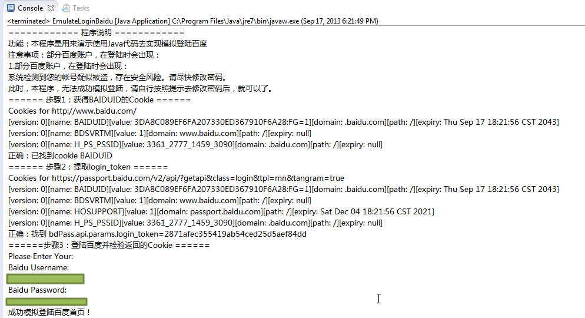

# Java模拟登录百度首页

很早之前用过Java实现了模拟百度登录。

主体代码是：

```java
/**
 * [File]
 * EmulateLoginBaidu.java
 *
 * [Function]
 * Use Java code to emulate login baidu
 *
 * 【教程】模拟登陆百度之Java代码版
 * https://www.crifan.com/emulate_login_baidu_use_java_code
 *
 * [Version]
 * v1.0, 2013-09-17
 *
 * [Note]
 * 1. need add apache http lib:
 * 【已解决】Eclipse的java代码出错：The import org.apache cannot be resolved
 * https://www.crifan.com/java_eclipse_the_import_org_apache_cannot_be_resolved/
 * 2.need crifanLib.java
 * http://code.google.com/p/crifanlib/source/browse/trunk/java/crifanLib.java
 *
 * [History]
 * [v1.0]
 * 1. initial version, finally successfully emulate login baidu using java code.
 */
 
//import java.io.IOException;
import java.util.ArrayList;
//import java.util.Calendar;
//import java.util.Date;
//import java.util.GregorianCalendar;
import java.util.HashMap;
//import java.util.Hashtable;
import java.util.List;
//import java.util.Map;
import java.util.Scanner;
import java.util.regex.Matcher;
import java.util.regex.Pattern;
 
import org.apache.http.HttpResponse;
import org.apache.http.NameValuePair;
import org.apache.http.cookie.Cookie;
//import org.apache.http.impl.cookie.BasicClientCookie;
//import org.apache.http.impl.cookie.BasicClientCookie2;
import org.apache.http.message.BasicNameValuePair;
 
//import crifanLib;
 
/**
 * @author CLi
 *
 */
public class EmulateLoginBaidu {
    static crifanLib crl;
 
    /**
     * @param args
     */
    public static void main(String[] args) {
        crl = new crifanLib();
                 
        // TODO Auto-generated method stub
        EmulateLoginBaiduUsingJava();
    }
 
    // emulate login baidu using java code 
    public static void EmulateLoginBaiduUsingJava()
    {
        System.out.println("============ 程序说明 ============");
        System.out.println("功能：本程序是用来演示使用Java代码去实现模拟登陆百度");
        System.out.println("注意事项：部分百度账户，在登陆时会出现：");
        System.out.println("1.部分百度账户，在登陆时会出现：");
        System.out.println("系统检测到您的帐号疑似被盗，存在安全风险。请尽快修改密码。");
        System.out.println("此时，本程序，无法成功模拟登陆，请自行按照提示去修改密码后，就可以了。");
         
        boolean bLoginBaiduOk = false;
        List<Cookie> curCookieList;
         
        //step1: login baidu, got cookie BAIDUID
        System.out.println("====== 步骤1：获得BAIDUID的Cookie ======");
        String strTokenValue = "";
        boolean bGotCookieBaiduid = false;
        String strBaiduUrl = "http://www.baidu.com/";
        HttpResponse baiduResp = crl.getUrlResponse(strBaiduUrl);
         
        curCookieList =crl.getCurCookieStore().getCookies();
        crl.dbgPrintCookies(curCookieList, strBaiduUrl);
        for(Cookie ck : curCookieList)
        {
            String cookieName = ck.getName();
            if(cookieName.equals("BAIDUID"))
            {
                bGotCookieBaiduid = true;
            }
        }
        if (bGotCookieBaiduid)
        {
            System.out.println("正确：已找到cookie BAIDUID");
        }
        else
        {
            System.out.println("错误：没有找到cookie BAIDUID ！");
        }
         
        //step2: login, pass paras, extract resp cookie
        System.out.println("====== 步骤2：提取login_token ======");
        boolean bExtractTokenValueOK = false;
        if(bGotCookieBaiduid)
        {
            //https://passport.baidu.com/v2/api/?getapi&class=login&tpl=mn&tangram=true
            String getapiUrl = "https://passport.baidu.com/v2/api/?getapi&class=login&tpl=mn&tangram=true";
            String getApiRespHtml = crl.getUrlRespHtml(getapiUrl);
             
            curCookieList =crl.getCurCookieStore().getCookies();
            crl.dbgPrintCookies(curCookieList, getapiUrl);
 
            //bdPass.api.params.login_token='3cf421493884e0fe9080593d05f4744f';
            Pattern tokenValP = Pattern.compile("bdPass\\.api\\.params\\.login_token='(?<tokenVal>\\w+)';");
            Matcher tokenValMatcher = tokenValP.matcher(getApiRespHtml);
            //boolean foundTokenValue = tokenValMatcher.matches(); // will not match, but can search to find it
            boolean foundTokenValue = tokenValMatcher.find();
            if(foundTokenValue)
            {
                strTokenValue = tokenValMatcher.group("tokenVal"); //3cf421493884e0fe9080593d05f4744f
                System.out.println("正确：找到 bdPass.api.params.login_token=" + strTokenValue);
                 
                bExtractTokenValueOK = true;
            }
            else
            {
                System.out.println("错误：没找到bdPass.api.params.login_token !");
            }
        }
         
        //step3: verify returned cookies
        if (bGotCookieBaiduid && bExtractTokenValueOK)
        {
            System.out.println("======步骤3：登陆百度并检验返回的Cookie ======");
             
            /*
            //Note:
            //here, has verify, not manually update some cookie's domain and expiry
            //also can emulate baidu successfully
             
            //do some workaround to makesure here cookie H_PS_PSSID not expire
            //[version: 0][name: H_PS_PSSID][value: 3359_3341_2776_1424_2981][domain: .baidu.com][path: /][expiry: null]
             
            //Thu Sep 17 14:22:08 CST 2043
            //Date newExpiryDate = new Date(2043, 9, 17);
            Date newExpiryDate = new Date(143, 9, 17);
            //Calendar newExpiryCalendar = new GregorianCalendar(2043, 9, 17, 14, 22, 8);
             
            BasicClientCookie hPsPssidCookie = null;
            BasicClientCookie dbsvrtmCookie = null;
            //int hPsPssidCookieIdx = 0;
             
            curCookieList = crl.getCurCookieList();
            for(Cookie ck : curCookieList)
            {
                if(ck.getName().equalsIgnoreCase("H_PS_PSSID"))
                {
                    //hPsPssidCookieIdx = curCookieList.indexOf(ck);
                    hPsPssidCookie = (BasicClientCookie) ck;
                    hPsPssidCookie.setExpiryDate(newExpiryDate);
                    ck = hPsPssidCookie;
                    //break;
                }
                 
                if(ck.getName().equalsIgnoreCase("BDSVRTM"))
                {
                    dbsvrtmCookie = (BasicClientCookie) ck;
                    dbsvrtmCookie.setDomain(".baidu.com");
                    dbsvrtmCookie.setExpiryDate(newExpiryDate);
                    ck = dbsvrtmCookie;
                    //break;
                }
            }
            crl.setCurCookieList(curCookieList);
            */
 
             
            String staticPageUrl = "http://www.baidu.com/cache/user/html/jump.html";
 
            List<NameValuePair> postDict = new ArrayList<NameValuePair>();
            //ArrayList<NameValuePair> headerDict = new ArrayList<NameValuePair>();
            //postDict.add(new BasicNameValuePair("ppui_logintime", ""));
            postDict.add(new BasicNameValuePair("charset", "utf-8"));
            //postDict.add(new BasicNameValuePair("codestring", ""));
            postDict.add(new BasicNameValuePair("token", strTokenValue));
            postDict.add(new BasicNameValuePair("isPhone", "false"));
            postDict.add(new BasicNameValuePair("index", "0"));
            //postDict.add(new BasicNameValuePair("u", ""));
            //postDict.add(new BasicNameValuePair("safeflg", "0"));
            postDict.add(new BasicNameValuePair("staticpage", staticPageUrl));
            postDict.add(new BasicNameValuePair("loginType", "1"));
            postDict.add(new BasicNameValuePair("tpl", "mn"));
            postDict.add(new BasicNameValuePair("callback", "parent.bdPass.api.login._postCallback"));
             
            //get input baidu username and password
            String strBaiduUsername = "";
            String strBaiduPassword = "";
            Scanner inputReader = new Scanner(System.in);
            System.out.println("Please Enter Your:" );
            System.out.println("Baidu Username:" );
            strBaiduUsername = inputReader.nextLine();
            //System.out.println("You Entered Username=" + strBaiduUsername);
            System.out.println("Baidu Password:" );
            strBaiduPassword = inputReader.nextLine();
            //System.out.println("You Entered Password=" + strBaiduPassword);
            inputReader.close();
 
            postDict.add(new BasicNameValuePair("username", strBaiduUsername));
            postDict.add(new BasicNameValuePair("password", strBaiduPassword));
             
            postDict.add(new BasicNameValuePair("verifycode", ""));
            postDict.add(new BasicNameValuePair("mem_pass", "on"));
 
            String baiduMainLoginUrl = "https://passport.baidu.com/v2/api/?login";
            String loginBaiduRespHtml = crl.getUrlRespHtml(baiduMainLoginUrl, null, postDict);
             
            //Map cookieNameDict = new Map();
            //Map cookieNameDict = new Hashtable();
            HashMap<Object, Boolean> cookieNameDict = new HashMap<Object, Boolean>();    
            cookieNameDict.put("BDUSS", false);
            cookieNameDict.put("PTOKEN", false);
            cookieNameDict.put("STOKEN", false);
            //Set-Cookie: SAVEUSERID=deleted; expires=Mon, 17-Sep-2012 09:45:03 GMT; path=/; domain=passport.baidu.com; httponly,
            //cookieNameDict.put("SAVEUSERID", false);
             
            curCookieList = crl.getCurCookieList();
            for(Object objCookieName : cookieNameDict.keySet().toArray())
            {
                String strCookieName = objCookieName.toString();
                for(Cookie ck: curCookieList)
                {
                    if(strCookieName.equalsIgnoreCase(ck.getName()))
                    {
                        cookieNameDict.put(strCookieName, true);
                    }
                }
            }
             
            boolean bAllCookiesFound = true;
            for (Object  objFoundCurCookie : cookieNameDict.values())
            {
                bAllCookiesFound = bAllCookiesFound && Boolean.parseBoolean(objFoundCurCookie.toString());
            }
 
            bLoginBaiduOk = bAllCookiesFound;
                         
            if (bLoginBaiduOk)
            {
                System.out.println("成功模拟登陆百度首页！" );
            }
            else
            {
                System.out.println("模拟登陆百度首页 失败！");
                System.out.println("所返回的HTML源码为：" + loginBaiduRespHtml);
            }
        }
 
        return;
    }
}
```

成功模拟登陆百度，输出效果截图：



完整的Eclipse项目源码下载：

* [EmulateLoginBaidu_java_2013-09-17_crifanLibVersion.7z](http://book.crifan.com/books/crawl_your_data_spider_technology/website/assets/file/EmulateLoginBaidu_java_2013-09-17_crifanLibVersion.7z)
  * 注意事项
    * 需要导入`org.apache.http`的库
      * 详见：[【已解决】Eclipse的java代码出错：The import org.apache cannot be resolved](https://www.crifan.com/java_eclipse_the_import_org_apache_cannot_be_resolved/)
    * 其中用到的`crifanLib`的java代码详见：
      * [crifanLib.java](https://github.com/crifan/crifanLib/blob/master/java/crifanLib.java)
    * 部分百度账户，在登陆时会出现 `系统检测到您的帐号疑似被盗，存在安全风险。请尽快修改密码。`，此时本程序无法成功模拟登陆，请自行按照提示去修改密码后，即可成功模拟登录

具体过程详见：

[【教程】模拟登陆百度之Java代码版](http://www.crifan.com/emulate_login_baidu_use_java_code/)