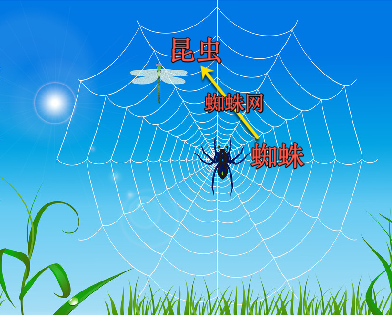
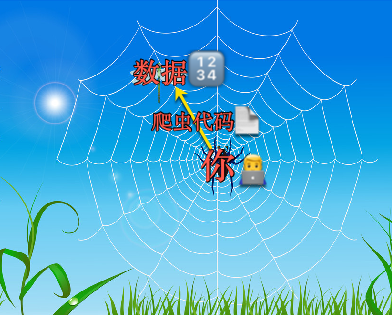

# 为何叫爬虫

通过下面类比，来解释为何被叫做爬虫：

| 对比 | **现实世界**的**蜘蛛网** | **计算机**世界的**互联网** |
| ---- | ----------------- | ------------------- |
| 图解 |  |  |
| | `蜘蛛`🕷 | `你`👨‍💻‍自己 |
| | `织网` = 用`蜘蛛网` 🕸 | 写`爬虫`代码📄=`crawler`=`spider` |
| | `捕获`=`抓`自己要的`东西`=`食物`=`昆虫`🐞|  `爬取`=`抓包` 自己要的`数据`🔢(并保存) |

## 相关说明

* `互联网`：是一个包含众多资源的大网络
  * `狭义`上说，主要指的是：
    * Web领域=各种`网站`=`网页`
      * 里面有各种（我们想要爬取的）数据
        * 比如想要爬取汽车的车型车系，可以从`汽车之`家等网站爬取
  * `广义`上说包含：
    * （上面提到的）各种网站=网页
    * 各种`app`
      * 包括各种`Android`和`iOS`中的app软件
      * 比如想要爬取别人的app中的一些数据
        * 比如爬取大众点评app中的商家和用户评论数据
    * 各种`其他渠道`、`终端`的数据和资源
      * `微信公众号`
        * 理论上也是属于`网页`
      * `小程序`
        * `微信小程序`
        * `支付宝小程序`
      * 等等

